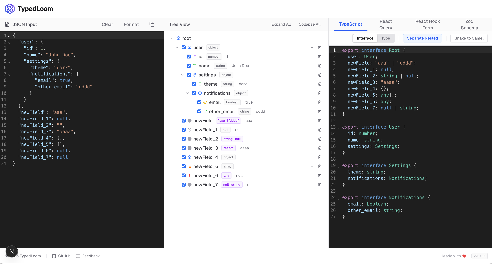

# TypedLoom

**TypedLoom** is a powerful visual schema builder and code generator for TypeScript and Zod. It helps developers visualize, edit, and generate complex data structures with ease.



## ✨ Key Features

- **Visual Schema Builder**: Intuitively design your data structure using a tree view editor. Add, remove, and modify nodes without writing a single line of JSON.
- **Advanced Type Builder**:
  - **Union Types**: Easily create complex union types (e.g., `string | number`) via UI.
  - **String/Numeric Literals**: Manage literal types (e.g., `"active" | "inactive"`, `1 | 2`) with a simple tag-based interface.
- **Real-time Conversion**: Instantly generate **TypeScript Interfaces** and **Zod Schemas** from your data structure.
- **Smart JSON Editor**: Full-featured JSON editor with error highlighting and formatting (powered by `jsonrepair`).
- **Privacy First**: All processing happens **client-side**. Your data never leaves your browser.

## 🛠️ Getting Started

First, install the dependencies:

```bash
npm install
# or
yarn install
```

Then, run the development server:

```bash
npm run dev
# or
yarn dev
```

Open [http://localhost:3000](http://localhost:3000) with your browser to see the result.

## 💻 Tech Stack

- **Framework**: Next.js 14 (App Router)
- **Styling**: Tailwind CSS
- **Icons**: Lucide React
- **Editor**: CodeMirror (@uiw/react-codemirror)
- **Utilities**: quicktype-core, jsonrepair

## 🤝 Contributing

Contributions are welcome! Please feel free to submit a Pull Request or open an issue on the [Issues](https://github.com/nomore12/TypedLoom/issues) page.

## 📄 License

This project is open source and available under the [MIT License](LICENSE).
